# Notebook Imports


```python
from sklearn.datasets import load_boston
from sklearn.model_selection import train_test_split
from sklearn.linear_model import LinearRegression

import pandas as pd
import matplotlib.pyplot as plt
import seaborn as sns
import numpy as np

import statsmodels.api as sm
from statsmodels.stats.outliers_influence import variance_inflation_factor

%matplotlib inline
```

# Gather Data


```python
boston_dataset=load_boston()
```


```python
type(boston_dataset)
```


    sklearn.utils.Bunch


```python
boston_dataset
```


    {'data': array([[6.3200e-03, 1.8000e+01, 2.3100e+00, ..., 1.5300e+01, 3.9690e+02,
             4.9800e+00],
            [2.7310e-02, 0.0000e+00, 7.0700e+00, ..., 1.7800e+01, 3.9690e+02,
             9.1400e+00],
            [2.7290e-02, 0.0000e+00, 7.0700e+00, ..., 1.7800e+01, 3.9283e+02,
             4.0300e+00],
            ...,
            [6.0760e-02, 0.0000e+00, 1.1930e+01, ..., 2.1000e+01, 3.9690e+02,
             5.6400e+00],
            [1.0959e-01, 0.0000e+00, 1.1930e+01, ..., 2.1000e+01, 3.9345e+02,
             6.4800e+00],
            [4.7410e-02, 0.0000e+00, 1.1930e+01, ..., 2.1000e+01, 3.9690e+02,
             7.8800e+00]]),
     'target': array([24. , 21.6, 34.7, 33.4, 36.2, 28.7, 22.9, 27.1, 16.5, 18.9, 15. ,
            18.9, 21.7, 20.4, 18.2, 19.9, 23.1, 17.5, 20.2, 18.2, 13.6, 19.6,
            15.2, 14.5, 15.6, 13.9, 16.6, 14.8, 18.4, 21. , 12.7, 14.5, 13.2,
            13.1, 13.5, 18.9, 20. , 21. , 24.7, 30.8, 34.9, 26.6, 25.3, 24.7,
            21.2, 19.3, 20. , 16.6, 14.4, 19.4, 19.7, 20.5, 25. , 23.4, 18.9,
            35.4, 24.7, 31.6, 23.3, 19.6, 18.7, 16. , 22.2, 25. , 33. , 23.5,
            19.4, 22. , 17.4, 20.9, 24.2, 21.7, 22.8, 23.4, 24.1, 21.4, 20. ,
            20.8, 21.2, 20.3, 28. , 23.9, 24.8, 22.9, 23.9, 26.6, 22.5, 22.2,
            23.6, 28.7, 22.6, 22. , 22.9, 25. , 20.6, 28.4, 21.4, 38.7, 43.8,
            33.2, 27.5, 26.5, 18.6, 19.3, 20.1, 19.5, 19.5, 20.4, 19.8, 19.4,
            21.7, 22.8, 18.8, 18.7, 18.5, 18.3, 21.2, 19.2, 20.4, 19.3, 22. ,
            20.3, 20.5, 17.3, 18.8, 21.4, 15.7, 16.2, 18. , 14.3, 19.2, 19.6,
            23. , 18.4, 15.6, 18.1, 17.4, 17.1, 13.3, 17.8, 14. , 14.4, 13.4,
            15.6, 11.8, 13.8, 15.6, 14.6, 17.8, 15.4, 21.5, 19.6, 15.3, 19.4,
            17. , 15.6, 13.1, 41.3, 24.3, 23.3, 27. , 50. , 50. , 50. , 22.7,
            25. , 50. , 23.8, 23.8, 22.3, 17.4, 19.1, 23.1, 23.6, 22.6, 29.4,
            23.2, 24.6, 29.9, 37.2, 39.8, 36.2, 37.9, 32.5, 26.4, 29.6, 50. ,
            32. , 29.8, 34.9, 37. , 30.5, 36.4, 31.1, 29.1, 50. , 33.3, 30.3,
            34.6, 34.9, 32.9, 24.1, 42.3, 48.5, 50. , 22.6, 24.4, 22.5, 24.4,
            20. , 21.7, 19.3, 22.4, 28.1, 23.7, 25. , 23.3, 28.7, 21.5, 23. ,
            26.7, 21.7, 27.5, 30.1, 44.8, 50. , 37.6, 31.6, 46.7, 31.5, 24.3,
            31.7, 41.7, 48.3, 29. , 24. , 25.1, 31.5, 23.7, 23.3, 22. , 20.1,
            22.2, 23.7, 17.6, 18.5, 24.3, 20.5, 24.5, 26.2, 24.4, 24.8, 29.6,
            42.8, 21.9, 20.9, 44. , 50. , 36. , 30.1, 33.8, 43.1, 48.8, 31. ,
            36.5, 22.8, 30.7, 50. , 43.5, 20.7, 21.1, 25.2, 24.4, 35.2, 32.4,
            32. , 33.2, 33.1, 29.1, 35.1, 45.4, 35.4, 46. , 50. , 32.2, 22. ,
            20.1, 23.2, 22.3, 24.8, 28.5, 37.3, 27.9, 23.9, 21.7, 28.6, 27.1,
            20.3, 22.5, 29. , 24.8, 22. , 26.4, 33.1, 36.1, 28.4, 33.4, 28.2,
            22.8, 20.3, 16.1, 22.1, 19.4, 21.6, 23.8, 16.2, 17.8, 19.8, 23.1,
            21. , 23.8, 23.1, 20.4, 18.5, 25. , 24.6, 23. , 22.2, 19.3, 22.6,
            19.8, 17.1, 19.4, 22.2, 20.7, 21.1, 19.5, 18.5, 20.6, 19. , 18.7,
            32.7, 16.5, 23.9, 31.2, 17.5, 17.2, 23.1, 24.5, 26.6, 22.9, 24.1,
            18.6, 30.1, 18.2, 20.6, 17.8, 21.7, 22.7, 22.6, 25. , 19.9, 20.8,
            16.8, 21.9, 27.5, 21.9, 23.1, 50. , 50. , 50. , 50. , 50. , 13.8,
            13.8, 15. , 13.9, 13.3, 13.1, 10.2, 10.4, 10.9, 11.3, 12.3,  8.8,
             7.2, 10.5,  7.4, 10.2, 11.5, 15.1, 23.2,  9.7, 13.8, 12.7, 13.1,
            12.5,  8.5,  5. ,  6.3,  5.6,  7.2, 12.1,  8.3,  8.5,  5. , 11.9,
            27.9, 17.2, 27.5, 15. , 17.2, 17.9, 16.3,  7. ,  7.2,  7.5, 10.4,
             8.8,  8.4, 16.7, 14.2, 20.8, 13.4, 11.7,  8.3, 10.2, 10.9, 11. ,
             9.5, 14.5, 14.1, 16.1, 14.3, 11.7, 13.4,  9.6,  8.7,  8.4, 12.8,
            10.5, 17.1, 18.4, 15.4, 10.8, 11.8, 14.9, 12.6, 14.1, 13. , 13.4,
            15.2, 16.1, 17.8, 14.9, 14.1, 12.7, 13.5, 14.9, 20. , 16.4, 17.7,
            19.5, 20.2, 21.4, 19.9, 19. , 19.1, 19.1, 20.1, 19.9, 19.6, 23.2,
            29.8, 13.8, 13.3, 16.7, 12. , 14.6, 21.4, 23. , 23.7, 25. , 21.8,
            20.6, 21.2, 19.1, 20.6, 15.2,  7. ,  8.1, 13.6, 20.1, 21.8, 24.5,
            23.1, 19.7, 18.3, 21.2, 17.5, 16.8, 22.4, 20.6, 23.9, 22. , 11.9]),
     'feature_names': array(['CRIM', 'ZN', 'INDUS', 'CHAS', 'NOX', 'RM', 'AGE', 'DIS', 'RAD',
            'TAX', 'PTRATIO', 'B', 'LSTAT'], dtype='<U7'),
     'DESCR': ".. _boston_dataset:\n\nBoston house prices dataset\n---------------------------\n\n**Data Set Characteristics:**  \n\n    :Number of Instances: 506 \n\n    :Number of Attributes: 13 numeric/categorical predictive. Median Value (attribute 14) is usually the target.\n\n    :Attribute Information (in order):\n        - CRIM     per capita crime rate by town\n        - ZN       proportion of residential land zoned for lots over 25,000 sq.ft.\n        - INDUS    proportion of non-retail business acres per town\n        - CHAS     Charles River dummy variable (= 1 if tract bounds river; 0 otherwise)\n        - NOX      nitric oxides concentration (parts per 10 million)\n        - RM       average number of rooms per dwelling\n        - AGE      proportion of owner-occupied units built prior to 1940\n        - DIS      weighted distances to five Boston employment centres\n        - RAD      index of accessibility to radial highways\n        - TAX      full-value property-tax rate per $10,000\n        - PTRATIO  pupil-teacher ratio by town\n        - B        1000(Bk - 0.63)^2 where Bk is the proportion of blacks by town\n        - LSTAT    % lower status of the population\n        - MEDV     Median value of owner-occupied homes in $1000's\n\n    :Missing Attribute Values: None\n\n    :Creator: Harrison, D. and Rubinfeld, D.L.\n\nThis is a copy of UCI ML housing dataset.\nhttps://archive.ics.uci.edu/ml/machine-learning-databases/housing/\n\n\nThis dataset was taken from the StatLib library which is maintained at Carnegie Mellon University.\n\nThe Boston house-price data of Harrison, D. and Rubinfeld, D.L. 'Hedonic\nprices and the demand for clean air', J. Environ. Economics & Management,\nvol.5, 81-102, 1978.   Used in Belsley, Kuh & Welsch, 'Regression diagnostics\n...', Wiley, 1980.   N.B. Various transformations are used in the table on\npages 244-261 of the latter.\n\nThe Boston house-price data has been used in many machine learning papers that address regression\nproblems.   \n     \n.. topic:: References\n\n   - Belsley, Kuh & Welsch, 'Regression diagnostics: Identifying Influential Data and Sources of Collinearity', Wiley, 1980. 244-261.\n   - Quinlan,R. (1993). Combining Instance-Based and Model-Based Learning. In Proceedings on the Tenth International Conference of Machine Learning, 236-243, University of Massachusetts, Amherst. Morgan Kaufmann.\n",
     'filename': 'C:\\Users\\Sushant Lenka\\.conda\\envs\\machineLearning\\lib\\site-packages\\sklearn\\datasets\\data\\boston_house_prices.csv'}


```python
dir(boston_dataset)
```


    ['DESCR', 'data', 'feature_names', 'filename', 'target']


```python
print(boston_dataset.DESCR)
```

    .. _boston_dataset:
    
    Boston house prices dataset
    ---------------------------
    
    **Data Set Characteristics:**  
    
        :Number of Instances: 506 
    
        :Number of Attributes: 13 numeric/categorical predictive. Median Value (attribute 14) is usually the target.
    
        :Attribute Information (in order):
            - CRIM     per capita crime rate by town
            - ZN       proportion of residential land zoned for lots over 25,000 sq.ft.
            - INDUS    proportion of non-retail business acres per town
            - CHAS     Charles River dummy variable (= 1 if tract bounds river; 0 otherwise)
            - NOX      nitric oxides concentration (parts per 10 million)
            - RM       average number of rooms per dwelling
            - AGE      proportion of owner-occupied units built prior to 1940
            - DIS      weighted distances to five Boston employment centres
            - RAD      index of accessibility to radial highways
            - TAX      full-value property-tax rate per $10,000
            - PTRATIO  pupil-teacher ratio by town
            - B        1000(Bk - 0.63)^2 where Bk is the proportion of blacks by town
            - LSTAT    % lower status of the population
            - MEDV     Median value of owner-occupied homes in $1000's
    
        :Missing Attribute Values: None
    
        :Creator: Harrison, D. and Rubinfeld, D.L.
    
    This is a copy of UCI ML housing dataset.
    https://archive.ics.uci.edu/ml/machine-learning-databases/housing/
    
    
    This dataset was taken from the StatLib library which is maintained at Carnegie Mellon University.
    
    The Boston house-price data of Harrison, D. and Rubinfeld, D.L. 'Hedonic
    prices and the demand for clean air', J. Environ. Economics & Management,
    vol.5, 81-102, 1978.   Used in Belsley, Kuh & Welsch, 'Regression diagnostics
    ...', Wiley, 1980.   N.B. Various transformations are used in the table on
    pages 244-261 of the latter.
    
    The Boston house-price data has been used in many machine learning papers that address regression
    problems.   
         
    .. topic:: References
    
       - Belsley, Kuh & Welsch, 'Regression diagnostics: Identifying Influential Data and Sources of Collinearity', Wiley, 1980. 244-261.
       - Quinlan,R. (1993). Combining Instance-Based and Model-Based Learning. In Proceedings on the Tenth International Conference of Machine Learning, 236-243, University of Massachusetts, Amherst. Morgan Kaufmann.
    
    

### Datapoints and Features


```python
boston_dataset.data
```


    array([[6.3200e-03, 1.8000e+01, 2.3100e+00, ..., 1.5300e+01, 3.9690e+02,
            4.9800e+00],
           [2.7310e-02, 0.0000e+00, 7.0700e+00, ..., 1.7800e+01, 3.9690e+02,
            9.1400e+00],
           [2.7290e-02, 0.0000e+00, 7.0700e+00, ..., 1.7800e+01, 3.9283e+02,
            4.0300e+00],
           ...,
           [6.0760e-02, 0.0000e+00, 1.1930e+01, ..., 2.1000e+01, 3.9690e+02,
            5.6400e+00],
           [1.0959e-01, 0.0000e+00, 1.1930e+01, ..., 2.1000e+01, 3.9345e+02,
            6.4800e+00],
           [4.7410e-02, 0.0000e+00, 1.1930e+01, ..., 2.1000e+01, 3.9690e+02,
            7.8800e+00]])


```python
boston_dataset.data.shape
```


    (506, 13)


```python
boston_dataset.feature_names
```


    array(['CRIM', 'ZN', 'INDUS', 'CHAS', 'NOX', 'RM', 'AGE', 'DIS', 'RAD',
           'TAX', 'PTRATIO', 'B', 'LSTAT'], dtype='<U7')


```python
#Actual prices in thousands
boston_dataset.target
```


    array([24. , 21.6, 34.7, 33.4, 36.2, 28.7, 22.9, 27.1, 16.5, 18.9, 15. ,
           18.9, 21.7, 20.4, 18.2, 19.9, 23.1, 17.5, 20.2, 18.2, 13.6, 19.6,
           15.2, 14.5, 15.6, 13.9, 16.6, 14.8, 18.4, 21. , 12.7, 14.5, 13.2,
           13.1, 13.5, 18.9, 20. , 21. , 24.7, 30.8, 34.9, 26.6, 25.3, 24.7,
           21.2, 19.3, 20. , 16.6, 14.4, 19.4, 19.7, 20.5, 25. , 23.4, 18.9,
           35.4, 24.7, 31.6, 23.3, 19.6, 18.7, 16. , 22.2, 25. , 33. , 23.5,
           19.4, 22. , 17.4, 20.9, 24.2, 21.7, 22.8, 23.4, 24.1, 21.4, 20. ,
           20.8, 21.2, 20.3, 28. , 23.9, 24.8, 22.9, 23.9, 26.6, 22.5, 22.2,
           23.6, 28.7, 22.6, 22. , 22.9, 25. , 20.6, 28.4, 21.4, 38.7, 43.8,
           33.2, 27.5, 26.5, 18.6, 19.3, 20.1, 19.5, 19.5, 20.4, 19.8, 19.4,
           21.7, 22.8, 18.8, 18.7, 18.5, 18.3, 21.2, 19.2, 20.4, 19.3, 22. ,
           20.3, 20.5, 17.3, 18.8, 21.4, 15.7, 16.2, 18. , 14.3, 19.2, 19.6,
           23. , 18.4, 15.6, 18.1, 17.4, 17.1, 13.3, 17.8, 14. , 14.4, 13.4,
           15.6, 11.8, 13.8, 15.6, 14.6, 17.8, 15.4, 21.5, 19.6, 15.3, 19.4,
           17. , 15.6, 13.1, 41.3, 24.3, 23.3, 27. , 50. , 50. , 50. , 22.7,
           25. , 50. , 23.8, 23.8, 22.3, 17.4, 19.1, 23.1, 23.6, 22.6, 29.4,
           23.2, 24.6, 29.9, 37.2, 39.8, 36.2, 37.9, 32.5, 26.4, 29.6, 50. ,
           32. , 29.8, 34.9, 37. , 30.5, 36.4, 31.1, 29.1, 50. , 33.3, 30.3,
           34.6, 34.9, 32.9, 24.1, 42.3, 48.5, 50. , 22.6, 24.4, 22.5, 24.4,
           20. , 21.7, 19.3, 22.4, 28.1, 23.7, 25. , 23.3, 28.7, 21.5, 23. ,
           26.7, 21.7, 27.5, 30.1, 44.8, 50. , 37.6, 31.6, 46.7, 31.5, 24.3,
           31.7, 41.7, 48.3, 29. , 24. , 25.1, 31.5, 23.7, 23.3, 22. , 20.1,
           22.2, 23.7, 17.6, 18.5, 24.3, 20.5, 24.5, 26.2, 24.4, 24.8, 29.6,
           42.8, 21.9, 20.9, 44. , 50. , 36. , 30.1, 33.8, 43.1, 48.8, 31. ,
           36.5, 22.8, 30.7, 50. , 43.5, 20.7, 21.1, 25.2, 24.4, 35.2, 32.4,
           32. , 33.2, 33.1, 29.1, 35.1, 45.4, 35.4, 46. , 50. , 32.2, 22. ,
           20.1, 23.2, 22.3, 24.8, 28.5, 37.3, 27.9, 23.9, 21.7, 28.6, 27.1,
           20.3, 22.5, 29. , 24.8, 22. , 26.4, 33.1, 36.1, 28.4, 33.4, 28.2,
           22.8, 20.3, 16.1, 22.1, 19.4, 21.6, 23.8, 16.2, 17.8, 19.8, 23.1,
           21. , 23.8, 23.1, 20.4, 18.5, 25. , 24.6, 23. , 22.2, 19.3, 22.6,
           19.8, 17.1, 19.4, 22.2, 20.7, 21.1, 19.5, 18.5, 20.6, 19. , 18.7,
           32.7, 16.5, 23.9, 31.2, 17.5, 17.2, 23.1, 24.5, 26.6, 22.9, 24.1,
           18.6, 30.1, 18.2, 20.6, 17.8, 21.7, 22.7, 22.6, 25. , 19.9, 20.8,
           16.8, 21.9, 27.5, 21.9, 23.1, 50. , 50. , 50. , 50. , 50. , 13.8,
           13.8, 15. , 13.9, 13.3, 13.1, 10.2, 10.4, 10.9, 11.3, 12.3,  8.8,
            7.2, 10.5,  7.4, 10.2, 11.5, 15.1, 23.2,  9.7, 13.8, 12.7, 13.1,
           12.5,  8.5,  5. ,  6.3,  5.6,  7.2, 12.1,  8.3,  8.5,  5. , 11.9,
           27.9, 17.2, 27.5, 15. , 17.2, 17.9, 16.3,  7. ,  7.2,  7.5, 10.4,
            8.8,  8.4, 16.7, 14.2, 20.8, 13.4, 11.7,  8.3, 10.2, 10.9, 11. ,
            9.5, 14.5, 14.1, 16.1, 14.3, 11.7, 13.4,  9.6,  8.7,  8.4, 12.8,
           10.5, 17.1, 18.4, 15.4, 10.8, 11.8, 14.9, 12.6, 14.1, 13. , 13.4,
           15.2, 16.1, 17.8, 14.9, 14.1, 12.7, 13.5, 14.9, 20. , 16.4, 17.7,
           19.5, 20.2, 21.4, 19.9, 19. , 19.1, 19.1, 20.1, 19.9, 19.6, 23.2,
           29.8, 13.8, 13.3, 16.7, 12. , 14.6, 21.4, 23. , 23.7, 25. , 21.8,
           20.6, 21.2, 19.1, 20.6, 15.2,  7. ,  8.1, 13.6, 20.1, 21.8, 24.5,
           23.1, 19.7, 18.3, 21.2, 17.5, 16.8, 22.4, 20.6, 23.9, 22. , 11.9])


```python
data=pd.DataFrame(data=boston_dataset.data,columns=boston_dataset.feature_names)

data['PRICE']=boston_dataset.target
```


```python
data.head(5)
```


<div>
<style scoped>
    .dataframe tbody tr th:only-of-type {
        vertical-align: middle;
    }

    .dataframe tbody tr th {
        vertical-align: top;
    }

    .dataframe thead th {
        text-align: right;
    }
</style>
<table border="1" class="dataframe">
  <thead>
    <tr style="text-align: right;">
      <th></th>
      <th>CRIM</th>
      <th>ZN</th>
      <th>INDUS</th>
      <th>CHAS</th>
      <th>NOX</th>
      <th>RM</th>
      <th>AGE</th>
      <th>DIS</th>
      <th>RAD</th>
      <th>TAX</th>
      <th>PTRATIO</th>
      <th>B</th>
      <th>LSTAT</th>
      <th>PRICE</th>
    </tr>
  </thead>
  <tbody>
    <tr>
      <th>0</th>
      <td>0.00632</td>
      <td>18.0</td>
      <td>2.31</td>
      <td>0.0</td>
      <td>0.538</td>
      <td>6.575</td>
      <td>65.2</td>
      <td>4.0900</td>
      <td>1.0</td>
      <td>296.0</td>
      <td>15.3</td>
      <td>396.90</td>
      <td>4.98</td>
      <td>24.0</td>
    </tr>
    <tr>
      <th>1</th>
      <td>0.02731</td>
      <td>0.0</td>
      <td>7.07</td>
      <td>0.0</td>
      <td>0.469</td>
      <td>6.421</td>
      <td>78.9</td>
      <td>4.9671</td>
      <td>2.0</td>
      <td>242.0</td>
      <td>17.8</td>
      <td>396.90</td>
      <td>9.14</td>
      <td>21.6</td>
    </tr>
    <tr>
      <th>2</th>
      <td>0.02729</td>
      <td>0.0</td>
      <td>7.07</td>
      <td>0.0</td>
      <td>0.469</td>
      <td>7.185</td>
      <td>61.1</td>
      <td>4.9671</td>
      <td>2.0</td>
      <td>242.0</td>
      <td>17.8</td>
      <td>392.83</td>
      <td>4.03</td>
      <td>34.7</td>
    </tr>
    <tr>
      <th>3</th>
      <td>0.03237</td>
      <td>0.0</td>
      <td>2.18</td>
      <td>0.0</td>
      <td>0.458</td>
      <td>6.998</td>
      <td>45.8</td>
      <td>6.0622</td>
      <td>3.0</td>
      <td>222.0</td>
      <td>18.7</td>
      <td>394.63</td>
      <td>2.94</td>
      <td>33.4</td>
    </tr>
    <tr>
      <th>4</th>
      <td>0.06905</td>
      <td>0.0</td>
      <td>2.18</td>
      <td>0.0</td>
      <td>0.458</td>
      <td>7.147</td>
      <td>54.2</td>
      <td>6.0622</td>
      <td>3.0</td>
      <td>222.0</td>
      <td>18.7</td>
      <td>396.90</td>
      <td>5.33</td>
      <td>36.2</td>
    </tr>
  </tbody>
</table>
</div>


```python
data.count()
```


    CRIM       506
    ZN         506
    INDUS      506
    CHAS       506
    NOX        506
    RM         506
    AGE        506
    DIS        506
    RAD        506
    TAX        506
    PTRATIO    506
    B          506
    LSTAT      506
    PRICE      506
    dtype: int64


## Cleaning Data


```python
pd.isnull(data).any()
```


    CRIM       False
    ZN         False
    INDUS      False
    CHAS       False
    NOX        False
    RM         False
    AGE        False
    DIS        False
    RAD        False
    TAX        False
    PTRATIO    False
    B          False
    LSTAT      False
    PRICE      False
    dtype: bool


```python
data.info()
```

    <class 'pandas.core.frame.DataFrame'>
    RangeIndex: 506 entries, 0 to 505
    Data columns (total 14 columns):
    CRIM       506 non-null float64
    ZN         506 non-null float64
    INDUS      506 non-null float64
    CHAS       506 non-null float64
    NOX        506 non-null float64
    RM         506 non-null float64
    AGE        506 non-null float64
    DIS        506 non-null float64
    RAD        506 non-null float64
    TAX        506 non-null float64
    PTRATIO    506 non-null float64
    B          506 non-null float64
    LSTAT      506 non-null float64
    PRICE      506 non-null float64
    dtypes: float64(14)
    memory usage: 55.4 KB
    

## Visualising Data


```python
plt.figure(figsize=[10,6])

plt.hist(data['PRICE'],bins=50,ec='black',color='#2196F3')
plt.xlabel('Price in 1000s')
plt.ylabel('No. of houses')
plt.show()
```


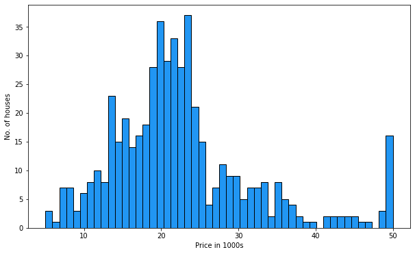


```python
plt.figure(figsize=[10,6])

sns.distplot(data['PRICE'],bins=50)

plt.show()
```


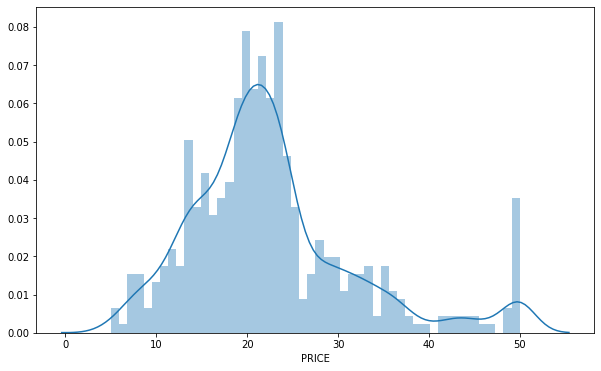


```python
plt.figure(figsize=[10,6])

plt.hist(data['RM'],ec='black',color='#00796b')
plt.xlabel('Number of rooms')
plt.ylabel('No. of houses')
plt.show()
```


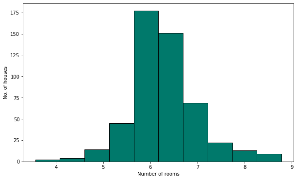


```python
data['RM'].mean()
```


    6.284634387351779


```python
plt.figure(figsize=[10,6])

plt.hist(data['RAD'],bins=24,ec='black',color='#7b1fa2')
plt.xlabel('Accessibility to highways')
plt.ylabel('No. of houses')
plt.show()
```


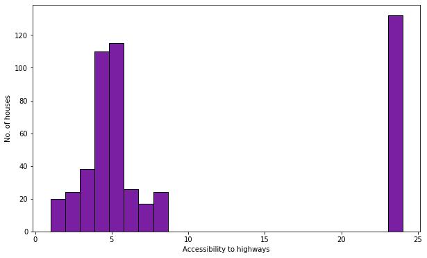


```python
data['RAD'].value_counts()
```


    24.0    132
    5.0     115
    4.0     110
    3.0      38
    6.0      26
    8.0      24
    2.0      24
    1.0      20
    7.0      17
    Name: RAD, dtype: int64


```python
frequency=data['RAD'].value_counts()

plt.figure(figsize=[10,6])
plt.bar(frequency.index,height=frequency)
plt.xlabel('Accessibility to highways')
plt.ylabel('No. of houses')

plt.show()
```


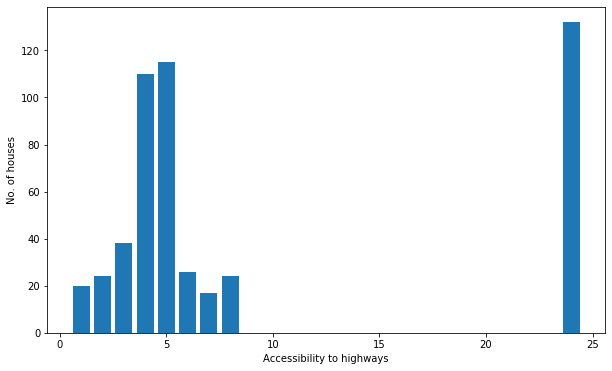


```python
data['CHAS'].value_counts()
```


    0.0    471
    1.0     35
    Name: CHAS, dtype: int64


# Descriptive Statistics


```python
print(data['PRICE'].min())
print(data['PRICE'].max())
print(data.min())
```

    5.0
    50.0
    CRIM         0.00632
    ZN           0.00000
    INDUS        0.46000
    CHAS         0.00000
    NOX          0.38500
    RM           3.56100
    AGE          2.90000
    DIS          1.12960
    RAD          1.00000
    TAX        187.00000
    PTRATIO     12.60000
    B            0.32000
    LSTAT        1.73000
    PRICE        5.00000
    dtype: float64
    


```python
data.mean()
```


    CRIM         3.613524
    ZN          11.363636
    INDUS       11.136779
    CHAS         0.069170
    NOX          0.554695
    RM           6.284634
    AGE         68.574901
    DIS          3.795043
    RAD          9.549407
    TAX        408.237154
    PTRATIO     18.455534
    B          356.674032
    LSTAT       12.653063
    PRICE       22.532806
    dtype: float64


```python
data.median()
```


    CRIM         0.25651
    ZN           0.00000
    INDUS        9.69000
    CHAS         0.00000
    NOX          0.53800
    RM           6.20850
    AGE         77.50000
    DIS          3.20745
    RAD          5.00000
    TAX        330.00000
    PTRATIO     19.05000
    B          391.44000
    LSTAT       11.36000
    PRICE       21.20000
    dtype: float64


```python
data.describe()
```


<div>
<style scoped>
    .dataframe tbody tr th:only-of-type {
        vertical-align: middle;
    }

    .dataframe tbody tr th {
        vertical-align: top;
    }

    .dataframe thead th {
        text-align: right;
    }
</style>
<table border="1" class="dataframe">
  <thead>
    <tr style="text-align: right;">
      <th></th>
      <th>CRIM</th>
      <th>ZN</th>
      <th>INDUS</th>
      <th>CHAS</th>
      <th>NOX</th>
      <th>RM</th>
      <th>AGE</th>
      <th>DIS</th>
      <th>RAD</th>
      <th>TAX</th>
      <th>PTRATIO</th>
      <th>B</th>
      <th>LSTAT</th>
      <th>PRICE</th>
    </tr>
  </thead>
  <tbody>
    <tr>
      <th>count</th>
      <td>506.000000</td>
      <td>506.000000</td>
      <td>506.000000</td>
      <td>506.000000</td>
      <td>506.000000</td>
      <td>506.000000</td>
      <td>506.000000</td>
      <td>506.000000</td>
      <td>506.000000</td>
      <td>506.000000</td>
      <td>506.000000</td>
      <td>506.000000</td>
      <td>506.000000</td>
      <td>506.000000</td>
    </tr>
    <tr>
      <th>mean</th>
      <td>3.613524</td>
      <td>11.363636</td>
      <td>11.136779</td>
      <td>0.069170</td>
      <td>0.554695</td>
      <td>6.284634</td>
      <td>68.574901</td>
      <td>3.795043</td>
      <td>9.549407</td>
      <td>408.237154</td>
      <td>18.455534</td>
      <td>356.674032</td>
      <td>12.653063</td>
      <td>22.532806</td>
    </tr>
    <tr>
      <th>std</th>
      <td>8.601545</td>
      <td>23.322453</td>
      <td>6.860353</td>
      <td>0.253994</td>
      <td>0.115878</td>
      <td>0.702617</td>
      <td>28.148861</td>
      <td>2.105710</td>
      <td>8.707259</td>
      <td>168.537116</td>
      <td>2.164946</td>
      <td>91.294864</td>
      <td>7.141062</td>
      <td>9.197104</td>
    </tr>
    <tr>
      <th>min</th>
      <td>0.006320</td>
      <td>0.000000</td>
      <td>0.460000</td>
      <td>0.000000</td>
      <td>0.385000</td>
      <td>3.561000</td>
      <td>2.900000</td>
      <td>1.129600</td>
      <td>1.000000</td>
      <td>187.000000</td>
      <td>12.600000</td>
      <td>0.320000</td>
      <td>1.730000</td>
      <td>5.000000</td>
    </tr>
    <tr>
      <th>25%</th>
      <td>0.082045</td>
      <td>0.000000</td>
      <td>5.190000</td>
      <td>0.000000</td>
      <td>0.449000</td>
      <td>5.885500</td>
      <td>45.025000</td>
      <td>2.100175</td>
      <td>4.000000</td>
      <td>279.000000</td>
      <td>17.400000</td>
      <td>375.377500</td>
      <td>6.950000</td>
      <td>17.025000</td>
    </tr>
    <tr>
      <th>50%</th>
      <td>0.256510</td>
      <td>0.000000</td>
      <td>9.690000</td>
      <td>0.000000</td>
      <td>0.538000</td>
      <td>6.208500</td>
      <td>77.500000</td>
      <td>3.207450</td>
      <td>5.000000</td>
      <td>330.000000</td>
      <td>19.050000</td>
      <td>391.440000</td>
      <td>11.360000</td>
      <td>21.200000</td>
    </tr>
    <tr>
      <th>75%</th>
      <td>3.677083</td>
      <td>12.500000</td>
      <td>18.100000</td>
      <td>0.000000</td>
      <td>0.624000</td>
      <td>6.623500</td>
      <td>94.075000</td>
      <td>5.188425</td>
      <td>24.000000</td>
      <td>666.000000</td>
      <td>20.200000</td>
      <td>396.225000</td>
      <td>16.955000</td>
      <td>25.000000</td>
    </tr>
    <tr>
      <th>max</th>
      <td>88.976200</td>
      <td>100.000000</td>
      <td>27.740000</td>
      <td>1.000000</td>
      <td>0.871000</td>
      <td>8.780000</td>
      <td>100.000000</td>
      <td>12.126500</td>
      <td>24.000000</td>
      <td>711.000000</td>
      <td>22.000000</td>
      <td>396.900000</td>
      <td>37.970000</td>
      <td>50.000000</td>
    </tr>
  </tbody>
</table>
</div>


## Correlation


```python
data['PRICE'].corr(data['RM'])
```


    0.695359947071539


```python
data['PRICE'].corr(data['PTRATIO'])
```


    -0.5077866855375615


```python
data.corr()
```


<div>
<style scoped>
    .dataframe tbody tr th:only-of-type {
        vertical-align: middle;
    }

    .dataframe tbody tr th {
        vertical-align: top;
    }

    .dataframe thead th {
        text-align: right;
    }
</style>
<table border="1" class="dataframe">
  <thead>
    <tr style="text-align: right;">
      <th></th>
      <th>CRIM</th>
      <th>ZN</th>
      <th>INDUS</th>
      <th>CHAS</th>
      <th>NOX</th>
      <th>RM</th>
      <th>AGE</th>
      <th>DIS</th>
      <th>RAD</th>
      <th>TAX</th>
      <th>PTRATIO</th>
      <th>B</th>
      <th>LSTAT</th>
      <th>PRICE</th>
    </tr>
  </thead>
  <tbody>
    <tr>
      <th>CRIM</th>
      <td>1.000000</td>
      <td>-0.200469</td>
      <td>0.406583</td>
      <td>-0.055892</td>
      <td>0.420972</td>
      <td>-0.219247</td>
      <td>0.352734</td>
      <td>-0.379670</td>
      <td>0.625505</td>
      <td>0.582764</td>
      <td>0.289946</td>
      <td>-0.385064</td>
      <td>0.455621</td>
      <td>-0.388305</td>
    </tr>
    <tr>
      <th>ZN</th>
      <td>-0.200469</td>
      <td>1.000000</td>
      <td>-0.533828</td>
      <td>-0.042697</td>
      <td>-0.516604</td>
      <td>0.311991</td>
      <td>-0.569537</td>
      <td>0.664408</td>
      <td>-0.311948</td>
      <td>-0.314563</td>
      <td>-0.391679</td>
      <td>0.175520</td>
      <td>-0.412995</td>
      <td>0.360445</td>
    </tr>
    <tr>
      <th>INDUS</th>
      <td>0.406583</td>
      <td>-0.533828</td>
      <td>1.000000</td>
      <td>0.062938</td>
      <td>0.763651</td>
      <td>-0.391676</td>
      <td>0.644779</td>
      <td>-0.708027</td>
      <td>0.595129</td>
      <td>0.720760</td>
      <td>0.383248</td>
      <td>-0.356977</td>
      <td>0.603800</td>
      <td>-0.483725</td>
    </tr>
    <tr>
      <th>CHAS</th>
      <td>-0.055892</td>
      <td>-0.042697</td>
      <td>0.062938</td>
      <td>1.000000</td>
      <td>0.091203</td>
      <td>0.091251</td>
      <td>0.086518</td>
      <td>-0.099176</td>
      <td>-0.007368</td>
      <td>-0.035587</td>
      <td>-0.121515</td>
      <td>0.048788</td>
      <td>-0.053929</td>
      <td>0.175260</td>
    </tr>
    <tr>
      <th>NOX</th>
      <td>0.420972</td>
      <td>-0.516604</td>
      <td>0.763651</td>
      <td>0.091203</td>
      <td>1.000000</td>
      <td>-0.302188</td>
      <td>0.731470</td>
      <td>-0.769230</td>
      <td>0.611441</td>
      <td>0.668023</td>
      <td>0.188933</td>
      <td>-0.380051</td>
      <td>0.590879</td>
      <td>-0.427321</td>
    </tr>
    <tr>
      <th>RM</th>
      <td>-0.219247</td>
      <td>0.311991</td>
      <td>-0.391676</td>
      <td>0.091251</td>
      <td>-0.302188</td>
      <td>1.000000</td>
      <td>-0.240265</td>
      <td>0.205246</td>
      <td>-0.209847</td>
      <td>-0.292048</td>
      <td>-0.355501</td>
      <td>0.128069</td>
      <td>-0.613808</td>
      <td>0.695360</td>
    </tr>
    <tr>
      <th>AGE</th>
      <td>0.352734</td>
      <td>-0.569537</td>
      <td>0.644779</td>
      <td>0.086518</td>
      <td>0.731470</td>
      <td>-0.240265</td>
      <td>1.000000</td>
      <td>-0.747881</td>
      <td>0.456022</td>
      <td>0.506456</td>
      <td>0.261515</td>
      <td>-0.273534</td>
      <td>0.602339</td>
      <td>-0.376955</td>
    </tr>
    <tr>
      <th>DIS</th>
      <td>-0.379670</td>
      <td>0.664408</td>
      <td>-0.708027</td>
      <td>-0.099176</td>
      <td>-0.769230</td>
      <td>0.205246</td>
      <td>-0.747881</td>
      <td>1.000000</td>
      <td>-0.494588</td>
      <td>-0.534432</td>
      <td>-0.232471</td>
      <td>0.291512</td>
      <td>-0.496996</td>
      <td>0.249929</td>
    </tr>
    <tr>
      <th>RAD</th>
      <td>0.625505</td>
      <td>-0.311948</td>
      <td>0.595129</td>
      <td>-0.007368</td>
      <td>0.611441</td>
      <td>-0.209847</td>
      <td>0.456022</td>
      <td>-0.494588</td>
      <td>1.000000</td>
      <td>0.910228</td>
      <td>0.464741</td>
      <td>-0.444413</td>
      <td>0.488676</td>
      <td>-0.381626</td>
    </tr>
    <tr>
      <th>TAX</th>
      <td>0.582764</td>
      <td>-0.314563</td>
      <td>0.720760</td>
      <td>-0.035587</td>
      <td>0.668023</td>
      <td>-0.292048</td>
      <td>0.506456</td>
      <td>-0.534432</td>
      <td>0.910228</td>
      <td>1.000000</td>
      <td>0.460853</td>
      <td>-0.441808</td>
      <td>0.543993</td>
      <td>-0.468536</td>
    </tr>
    <tr>
      <th>PTRATIO</th>
      <td>0.289946</td>
      <td>-0.391679</td>
      <td>0.383248</td>
      <td>-0.121515</td>
      <td>0.188933</td>
      <td>-0.355501</td>
      <td>0.261515</td>
      <td>-0.232471</td>
      <td>0.464741</td>
      <td>0.460853</td>
      <td>1.000000</td>
      <td>-0.177383</td>
      <td>0.374044</td>
      <td>-0.507787</td>
    </tr>
    <tr>
      <th>B</th>
      <td>-0.385064</td>
      <td>0.175520</td>
      <td>-0.356977</td>
      <td>0.048788</td>
      <td>-0.380051</td>
      <td>0.128069</td>
      <td>-0.273534</td>
      <td>0.291512</td>
      <td>-0.444413</td>
      <td>-0.441808</td>
      <td>-0.177383</td>
      <td>1.000000</td>
      <td>-0.366087</td>
      <td>0.333461</td>
    </tr>
    <tr>
      <th>LSTAT</th>
      <td>0.455621</td>
      <td>-0.412995</td>
      <td>0.603800</td>
      <td>-0.053929</td>
      <td>0.590879</td>
      <td>-0.613808</td>
      <td>0.602339</td>
      <td>-0.496996</td>
      <td>0.488676</td>
      <td>0.543993</td>
      <td>0.374044</td>
      <td>-0.366087</td>
      <td>1.000000</td>
      <td>-0.737663</td>
    </tr>
    <tr>
      <th>PRICE</th>
      <td>-0.388305</td>
      <td>0.360445</td>
      <td>-0.483725</td>
      <td>0.175260</td>
      <td>-0.427321</td>
      <td>0.695360</td>
      <td>-0.376955</td>
      <td>0.249929</td>
      <td>-0.381626</td>
      <td>-0.468536</td>
      <td>-0.507787</td>
      <td>0.333461</td>
      <td>-0.737663</td>
      <td>1.000000</td>
    </tr>
  </tbody>
</table>
</div>


```python
mask=np.zeros_like(data.corr())
triangle_indices=np.triu_indices_from(mask)
mask[triangle_indices]=True
```


```python
sns.set()
plt.figure(figsize=[16,10])
sns.heatmap(data.corr(),mask=mask,annot=True)
plt.xticks(fontsize=14)
plt.yticks(fontsize=14)
plt.show()
```


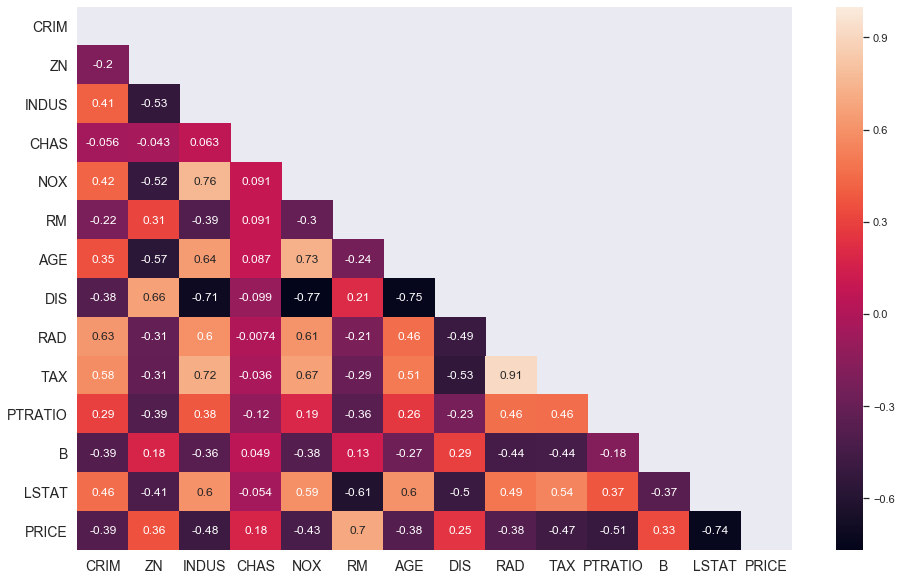


```python
nox_dis_corr=round(data['NOX'].corr(data['DIS']),3)

plt.figure(figsize=[9,6])
plt.scatter(data['DIS'],data['NOX'],alpha=0.6,s=80)
plt.xlabel('Distance from employment')
plt.ylabel('NOX levels')
plt.title(f'DIS vs NOX (Correlation {nox_dis_corr})')

plt.show()
```


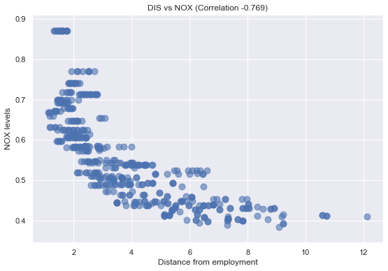


```python
sns.set()
sns.jointplot(x=data['DIS'],y=data['NOX'],height=7,joint_kws={'alpha':0.5},color='indigo')

plt.show()
```


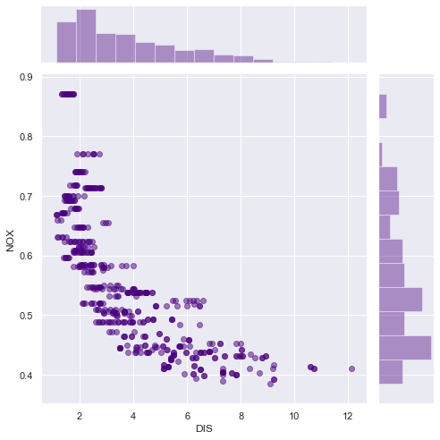


```python
sns.set()
sns.set_context('talk')
sns.set_style('whitegrid')
sns.jointplot(x=data['TAX'],y=data['RAD'],height=7,joint_kws={'alpha':0.5},color='darkred')

plt.show()
```


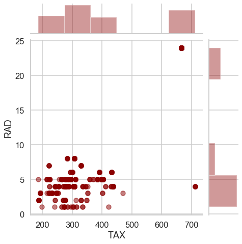


```python
sns.lmplot(x='TAX',y='RAD',data=data,height=7)
plt.show()
```


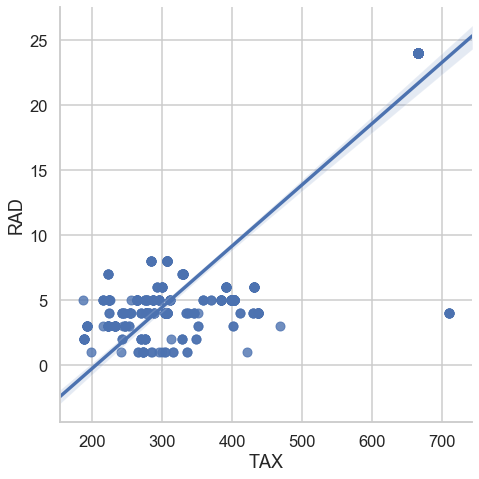


```python
rm_tgt_corr=round(data['RM'].corr(data['PRICE']),3)

plt.figure(figsize=[9,6])
plt.scatter(data['RM'],data['PRICE'],alpha=0.6,s=80)
plt.xlabel('Number of rooms')
plt.ylabel('Price of property in 1000s')
plt.title(f'RM vs TGT (Correlation {rm_tgt_corr})')

plt.show()
```


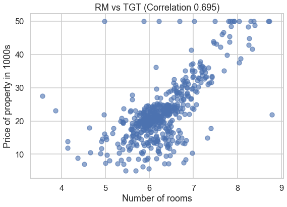


```python
sns.lmplot(x='RM',y='PRICE',data=data,height=7)
plt.show()
```


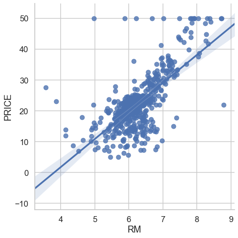


```python
%%time

sns.pairplot(data=data)
plt.show()
```


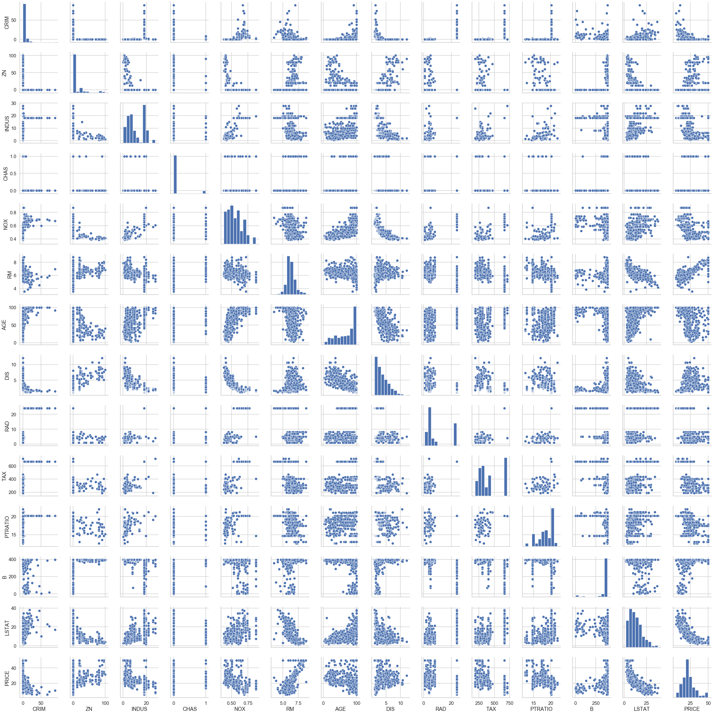


    Wall time: 40.7 s
    


```python
sns.pairplot(data,kind='reg',plot_kws={'line_kws':{'color':'cyan'}})
plt.show()
```


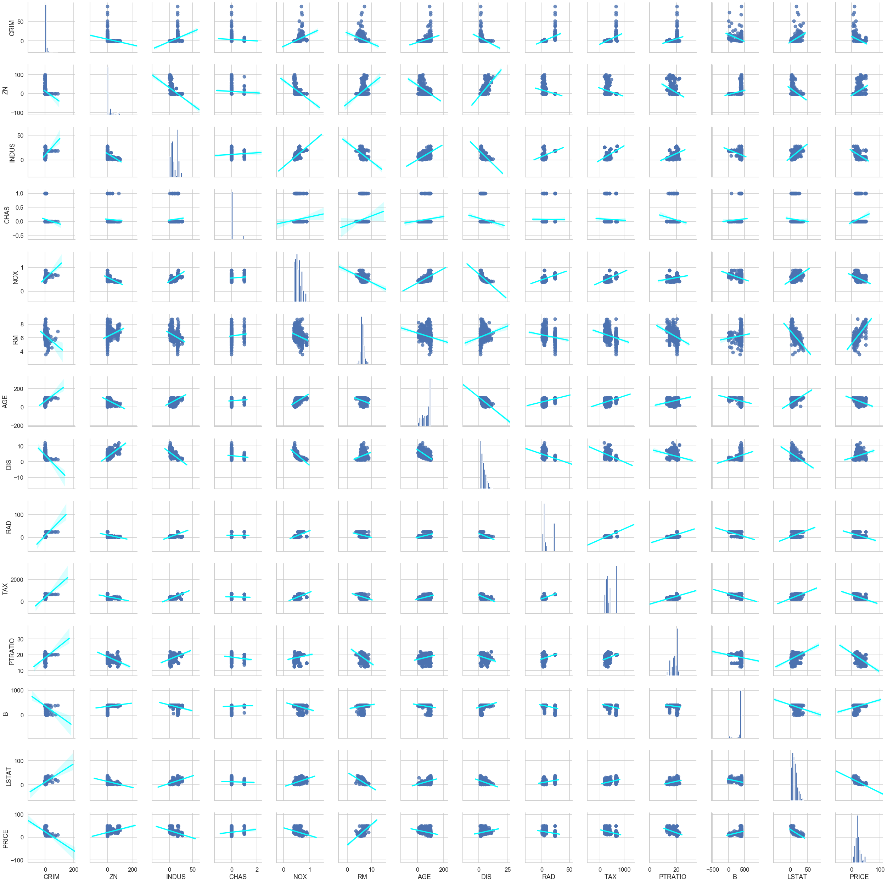


## Training and Test Dataset Split


```python
prices=data['PRICE']
features=data.drop('PRICE',axis=1)

X_train,X_test,y_train,y_test=train_test_split(features,prices,
                                               test_size=0.2,random_state=10)


```

## Multivariable Regression


```python
regr=LinearRegression()
regr.fit(X_train,y_train)

print('Intercept',regr.intercept_)
pd.DataFrame(data=regr.coef_,index=X_train.columns,columns=['Coef'])
```

    Intercept 36.53305138282439
    


<div>
<style scoped>
    .dataframe tbody tr th:only-of-type {
        vertical-align: middle;
    }

    .dataframe tbody tr th {
        vertical-align: top;
    }

    .dataframe thead th {
        text-align: right;
    }
</style>
<table border="1" class="dataframe">
  <thead>
    <tr style="text-align: right;">
      <th></th>
      <th>Coef</th>
    </tr>
  </thead>
  <tbody>
    <tr>
      <th>CRIM</th>
      <td>-0.128181</td>
    </tr>
    <tr>
      <th>ZN</th>
      <td>0.063198</td>
    </tr>
    <tr>
      <th>INDUS</th>
      <td>-0.007576</td>
    </tr>
    <tr>
      <th>CHAS</th>
      <td>1.974515</td>
    </tr>
    <tr>
      <th>NOX</th>
      <td>-16.271989</td>
    </tr>
    <tr>
      <th>RM</th>
      <td>3.108456</td>
    </tr>
    <tr>
      <th>AGE</th>
      <td>0.016292</td>
    </tr>
    <tr>
      <th>DIS</th>
      <td>-1.483014</td>
    </tr>
    <tr>
      <th>RAD</th>
      <td>0.303988</td>
    </tr>
    <tr>
      <th>TAX</th>
      <td>-0.012082</td>
    </tr>
    <tr>
      <th>PTRATIO</th>
      <td>-0.820306</td>
    </tr>
    <tr>
      <th>B</th>
      <td>0.011419</td>
    </tr>
    <tr>
      <th>LSTAT</th>
      <td>-0.581626</td>
    </tr>
  </tbody>
</table>
</div>


```python
print('Training data r-squared: ',regr.score(X_train,y_train))
print('Test data r-squared: ',regr.score(X_test,y_test))
```

    Training data r-squared:  0.750121534530608
    Test data r-squared:  0.6709339839115628
    

## Data Transformations


```python
data['PRICE'].skew()
```


    1.1080984082549072


```python
y_log=np.log(data['PRICE'])
```


```python
y_log.skew()
```


    -0.33032129530987864


```python
sns.distplot(y_log)
plt.title(f'log price with skew {y_log.skew()}')
plt.show()
```


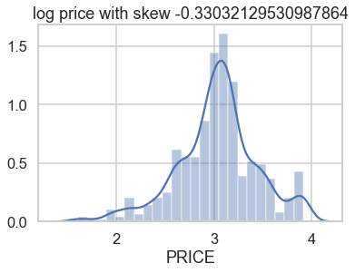


```python
sns.lmplot('LSTAT','PRICE',data,height=7,scatter_kws={'alpha':0.6},line_kws={'color':'darkred'})

plt.show()
```


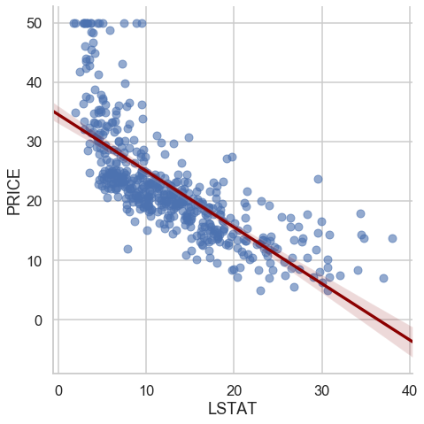


```python
transformed_data=features
transformed_data['LOG_PRICE']=y_log

sns.lmplot('LSTAT','LOG_PRICE',transformed_data,height=7,scatter_kws={'alpha':0.6},line_kws={'color':'cyan'})

plt.show()
```


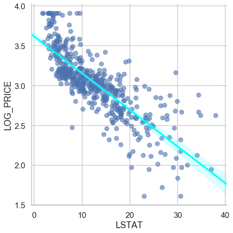


### Regression using log prices


```python
prices=np.log(data['PRICE'])
features=data.drop('PRICE',axis=1)

X_train,X_test,y_train,y_test=train_test_split(features,prices,
                                               test_size=0.2,random_state=10)

regr=LinearRegression()
regr.fit(X_train,y_train)

print('Intercept',regr.intercept_)
pd.DataFrame(data=regr.coef_,index=X_train.columns,columns=['Coef'])
```

    Intercept 4.05994387177519
    


<div>
<style scoped>
    .dataframe tbody tr th:only-of-type {
        vertical-align: middle;
    }

    .dataframe tbody tr th {
        vertical-align: top;
    }

    .dataframe thead th {
        text-align: right;
    }
</style>
<table border="1" class="dataframe">
  <thead>
    <tr style="text-align: right;">
      <th></th>
      <th>Coef</th>
    </tr>
  </thead>
  <tbody>
    <tr>
      <th>CRIM</th>
      <td>-0.010672</td>
    </tr>
    <tr>
      <th>ZN</th>
      <td>0.001579</td>
    </tr>
    <tr>
      <th>INDUS</th>
      <td>0.002030</td>
    </tr>
    <tr>
      <th>CHAS</th>
      <td>0.080331</td>
    </tr>
    <tr>
      <th>NOX</th>
      <td>-0.704068</td>
    </tr>
    <tr>
      <th>RM</th>
      <td>0.073404</td>
    </tr>
    <tr>
      <th>AGE</th>
      <td>0.000763</td>
    </tr>
    <tr>
      <th>DIS</th>
      <td>-0.047633</td>
    </tr>
    <tr>
      <th>RAD</th>
      <td>0.014565</td>
    </tr>
    <tr>
      <th>TAX</th>
      <td>-0.000645</td>
    </tr>
    <tr>
      <th>PTRATIO</th>
      <td>-0.034795</td>
    </tr>
    <tr>
      <th>B</th>
      <td>0.000516</td>
    </tr>
    <tr>
      <th>LSTAT</th>
      <td>-0.031390</td>
    </tr>
  </tbody>
</table>
</div>


```python
print('Training data r-squared: ',regr.score(X_train,y_train))
print('Test data r-squared: ',regr.score(X_test,y_test))
```

    Training data r-squared:  0.7930234826697583
    Test data r-squared:  0.7446922306260724
    

## p values and evaluating coefficients


```python
X_incl_const=sm.add_constant(X_train)

model=sm.OLS(y_train,X_incl_const)

results=model.fit()

#results.params
#results.pvalues

pd.DataFrame({'coef':results.params,'pvalue':round(results.pvalues,4)})
```

    C:\Users\Sushant Lenka\.conda\envs\machineLearning\lib\site-packages\numpy\core\fromnumeric.py:2389: FutureWarning: Method .ptp is deprecated and will be removed in a future version. Use numpy.ptp instead.
      return ptp(axis=axis, out=out, **kwargs)
    


<div>
<style scoped>
    .dataframe tbody tr th:only-of-type {
        vertical-align: middle;
    }

    .dataframe tbody tr th {
        vertical-align: top;
    }

    .dataframe thead th {
        text-align: right;
    }
</style>
<table border="1" class="dataframe">
  <thead>
    <tr style="text-align: right;">
      <th></th>
      <th>coef</th>
      <th>pvalue</th>
    </tr>
  </thead>
  <tbody>
    <tr>
      <th>const</th>
      <td>4.059944</td>
      <td>0.0000</td>
    </tr>
    <tr>
      <th>CRIM</th>
      <td>-0.010672</td>
      <td>0.0000</td>
    </tr>
    <tr>
      <th>ZN</th>
      <td>0.001579</td>
      <td>0.0086</td>
    </tr>
    <tr>
      <th>INDUS</th>
      <td>0.002030</td>
      <td>0.4445</td>
    </tr>
    <tr>
      <th>CHAS</th>
      <td>0.080331</td>
      <td>0.0382</td>
    </tr>
    <tr>
      <th>NOX</th>
      <td>-0.704068</td>
      <td>0.0000</td>
    </tr>
    <tr>
      <th>RM</th>
      <td>0.073404</td>
      <td>0.0001</td>
    </tr>
    <tr>
      <th>AGE</th>
      <td>0.000763</td>
      <td>0.2092</td>
    </tr>
    <tr>
      <th>DIS</th>
      <td>-0.047633</td>
      <td>0.0000</td>
    </tr>
    <tr>
      <th>RAD</th>
      <td>0.014565</td>
      <td>0.0000</td>
    </tr>
    <tr>
      <th>TAX</th>
      <td>-0.000645</td>
      <td>0.0001</td>
    </tr>
    <tr>
      <th>PTRATIO</th>
      <td>-0.034795</td>
      <td>0.0000</td>
    </tr>
    <tr>
      <th>B</th>
      <td>0.000516</td>
      <td>0.0000</td>
    </tr>
    <tr>
      <th>LSTAT</th>
      <td>-0.031390</td>
      <td>0.0000</td>
    </tr>
  </tbody>
</table>
</div>


## Testing for Multicollinearity


```python
variance_inflation_factor(exog=X_incl_const.values,exog_idx=1)
```


    1.7145250443932485


```python
vif=[]
for i in range(X_incl_const.shape[1]):
    vif.append(variance_inflation_factor(exog=X_incl_const.values,exog_idx=i))
    if i!=0:
        print(variance_inflation_factor(exog=X_incl_const.values,exog_idx=i))
```

    1.7145250443932485
    2.3328224265597584
    3.943448822674636
    1.0788133385000578
    4.410320817897635
    1.8404053075678568
    3.3267660823099408
    4.222923410477865
    7.314299817005058
    8.508856493040817
    1.839911632651406
    1.3386713255364715
    2.812544292793034
    


```python
pd.DataFrame({'coef_name':X_incl_const.columns,
             'vif':vif})
```


<div>
<style scoped>
    .dataframe tbody tr th:only-of-type {
        vertical-align: middle;
    }

    .dataframe tbody tr th {
        vertical-align: top;
    }

    .dataframe thead th {
        text-align: right;
    }
</style>
<table border="1" class="dataframe">
  <thead>
    <tr style="text-align: right;">
      <th></th>
      <th>coef_name</th>
      <th>vif</th>
    </tr>
  </thead>
  <tbody>
    <tr>
      <th>0</th>
      <td>const</td>
      <td>597.548713</td>
    </tr>
    <tr>
      <th>1</th>
      <td>CRIM</td>
      <td>1.714525</td>
    </tr>
    <tr>
      <th>2</th>
      <td>ZN</td>
      <td>2.332822</td>
    </tr>
    <tr>
      <th>3</th>
      <td>INDUS</td>
      <td>3.943449</td>
    </tr>
    <tr>
      <th>4</th>
      <td>CHAS</td>
      <td>1.078813</td>
    </tr>
    <tr>
      <th>5</th>
      <td>NOX</td>
      <td>4.410321</td>
    </tr>
    <tr>
      <th>6</th>
      <td>RM</td>
      <td>1.840405</td>
    </tr>
    <tr>
      <th>7</th>
      <td>AGE</td>
      <td>3.326766</td>
    </tr>
    <tr>
      <th>8</th>
      <td>DIS</td>
      <td>4.222923</td>
    </tr>
    <tr>
      <th>9</th>
      <td>RAD</td>
      <td>7.314300</td>
    </tr>
    <tr>
      <th>10</th>
      <td>TAX</td>
      <td>8.508856</td>
    </tr>
    <tr>
      <th>11</th>
      <td>PTRATIO</td>
      <td>1.839912</td>
    </tr>
    <tr>
      <th>12</th>
      <td>B</td>
      <td>1.338671</td>
    </tr>
    <tr>
      <th>13</th>
      <td>LSTAT</td>
      <td>2.812544</td>
    </tr>
  </tbody>
</table>
</div>


## Model Simplification and the BIC


```python
X_incl_const=sm.add_constant(X_train)

model=sm.OLS(y_train,X_incl_const)

results=model.fit()

org_coef=pd.DataFrame({'coef':results.params,'pvalue':round(results.pvalues,4)})

print('bic is: ',results.bic)
print('r-squared is: ',results.rsquared)
```

    bic is:  -139.74997769478875
    r-squared is:  0.7930234826697582
    


```python
X_incl_const=sm.add_constant(X_train)
X_incl_const=X_incl_const.drop(['INDUS'],axis=1)

model=sm.OLS(y_train,X_incl_const)

results=model.fit()

coef_minus_indus=pd.DataFrame({'coef':results.params,'pvalue':round(results.pvalues,4)})

print('bic is: ',results.bic)
print('r-squared is: ',results.rsquared)
```

    bic is:  -145.14508855591163
    r-squared is:  0.7927126289415163
    


```python
X_incl_const=sm.add_constant(X_train)
X_incl_const=X_incl_const.drop(['INDUS','AGE'],axis=1)

model=sm.OLS(y_train,X_incl_const)

results=model.fit()

reduced_coef=pd.DataFrame({'coef':results.params,'pvalue':round(results.pvalues,4)})

print('bic is: ',results.bic)
print('r-squared is: ',results.rsquared)
```

    bic is:  -149.49934294224656
    r-squared is:  0.7918657661852815
    


```python
frames=[org_coef,coef_minus_indus,reduced_coef]
pd.concat(frames,axis=1)
```

    C:\Users\Sushant Lenka\.conda\envs\machineLearning\lib\site-packages\ipykernel_launcher.py:2: FutureWarning: Sorting because non-concatenation axis is not aligned. A future version
    of pandas will change to not sort by default.
    
    To accept the future behavior, pass 'sort=False'.
    
    To retain the current behavior and silence the warning, pass 'sort=True'.
    
      
    


<div>
<style scoped>
    .dataframe tbody tr th:only-of-type {
        vertical-align: middle;
    }

    .dataframe tbody tr th {
        vertical-align: top;
    }

    .dataframe thead th {
        text-align: right;
    }
</style>
<table border="1" class="dataframe">
  <thead>
    <tr style="text-align: right;">
      <th></th>
      <th>coef</th>
      <th>pvalue</th>
      <th>coef</th>
      <th>pvalue</th>
      <th>coef</th>
      <th>pvalue</th>
    </tr>
  </thead>
  <tbody>
    <tr>
      <th>AGE</th>
      <td>0.000763</td>
      <td>0.2092</td>
      <td>0.000766</td>
      <td>0.2070</td>
      <td>NaN</td>
      <td>NaN</td>
    </tr>
    <tr>
      <th>B</th>
      <td>0.000516</td>
      <td>0.0000</td>
      <td>0.000511</td>
      <td>0.0000</td>
      <td>0.000518</td>
      <td>0.0000</td>
    </tr>
    <tr>
      <th>CHAS</th>
      <td>0.080331</td>
      <td>0.0382</td>
      <td>0.082795</td>
      <td>0.0320</td>
      <td>0.086449</td>
      <td>0.0249</td>
    </tr>
    <tr>
      <th>CRIM</th>
      <td>-0.010672</td>
      <td>0.0000</td>
      <td>-0.010721</td>
      <td>0.0000</td>
      <td>-0.010702</td>
      <td>0.0000</td>
    </tr>
    <tr>
      <th>DIS</th>
      <td>-0.047633</td>
      <td>0.0000</td>
      <td>-0.049394</td>
      <td>0.0000</td>
      <td>-0.052692</td>
      <td>0.0000</td>
    </tr>
    <tr>
      <th>INDUS</th>
      <td>0.002030</td>
      <td>0.4445</td>
      <td>NaN</td>
      <td>NaN</td>
      <td>NaN</td>
      <td>NaN</td>
    </tr>
    <tr>
      <th>LSTAT</th>
      <td>-0.031390</td>
      <td>0.0000</td>
      <td>-0.031262</td>
      <td>0.0000</td>
      <td>-0.030271</td>
      <td>0.0000</td>
    </tr>
    <tr>
      <th>NOX</th>
      <td>-0.704068</td>
      <td>0.0000</td>
      <td>-0.673365</td>
      <td>0.0000</td>
      <td>-0.616448</td>
      <td>0.0001</td>
    </tr>
    <tr>
      <th>PTRATIO</th>
      <td>-0.034795</td>
      <td>0.0000</td>
      <td>-0.034126</td>
      <td>0.0000</td>
      <td>-0.033481</td>
      <td>0.0000</td>
    </tr>
    <tr>
      <th>RAD</th>
      <td>0.014565</td>
      <td>0.0000</td>
      <td>0.014014</td>
      <td>0.0000</td>
      <td>0.013743</td>
      <td>0.0000</td>
    </tr>
    <tr>
      <th>RM</th>
      <td>0.073404</td>
      <td>0.0001</td>
      <td>0.071739</td>
      <td>0.0001</td>
      <td>0.076133</td>
      <td>0.0000</td>
    </tr>
    <tr>
      <th>TAX</th>
      <td>-0.000645</td>
      <td>0.0001</td>
      <td>-0.000596</td>
      <td>0.0000</td>
      <td>-0.000590</td>
      <td>0.0001</td>
    </tr>
    <tr>
      <th>ZN</th>
      <td>0.001579</td>
      <td>0.0086</td>
      <td>0.001551</td>
      <td>0.0097</td>
      <td>0.001461</td>
      <td>0.0141</td>
    </tr>
    <tr>
      <th>const</th>
      <td>4.059944</td>
      <td>0.0000</td>
      <td>4.056231</td>
      <td>0.0000</td>
      <td>4.035922</td>
      <td>0.0000</td>
    </tr>
  </tbody>
</table>
</div>


## Residuals and Residual Plots


```python
prices=np.log(data['PRICE'])
features=data.drop(['PRICE','AGE','INDUS'],axis=1)

X_train,X_test,y_train,y_test=train_test_split(features,prices,
                                               test_size=0.2,random_state=10)

X_incl_const=sm.add_constant(X_train)

model=sm.OLS(y_train,X_incl_const)

results=model.fit()

# residuals=y_train-results.fittedvalues
# residuals.describe()
# results.resid

corr=y_train.corr(results.fittedvalues)
plt.scatter(y_train,results.fittedvalues,c='navy',alpha=0.6)
plt.plot(y_train,y_train,c='cyan')

plt.xlabel('Actual log prices $y _i$',fontsize=14)
plt.ylabel('Predicted log prices $\hat y _i$',fontsize=14)
plt.title(f'Actual vs Pred log prices (corr {corr})')

plt.show()

#residuals vs predicted values
plt.scatter(results.fittedvalues,results.resid,c='navy',alpha=0.6)


plt.xlabel('Predicted log prices $\hat y _i$',fontsize=14)
plt.ylabel('Residuals',fontsize=14)
plt.title(f'Residuals vs fitted values')

plt.show()


```


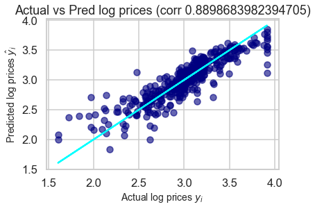


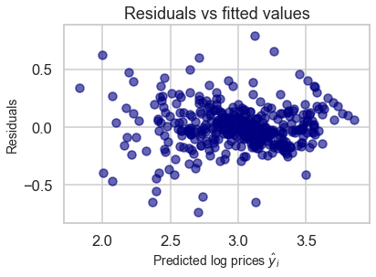


```python
# Checking for normality

resid_mean=round(results.resid.mean(),3)
resid_skew=round(results.resid.skew(),3)
resid_skew

sns.distplot(results.resid,color='navy')
plt.title('Residuals')
plt.show()
```


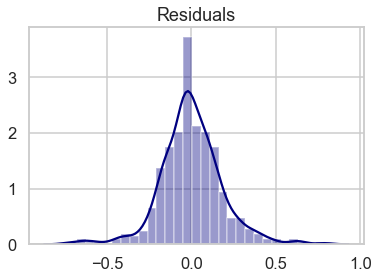


```python
# Generating the above plots using the previous model
prices=np.log(data['PRICE'])
features=data.drop(['PRICE'],axis=1)

X_train,X_test,y_train,y_test=train_test_split(features,prices,
                                               test_size=0.2,random_state=10)

X_incl_const=sm.add_constant(X_train)

model=sm.OLS(y_train,X_incl_const)

results=model.fit()

# residuals=y_train-results.fittedvalues
# residuals.describe()
# results.resid

corr=y_train.corr(results.fittedvalues)
plt.scatter(y_train,results.fittedvalues,c='navy',alpha=0.6)
plt.plot(y_train,y_train,c='cyan')

plt.xlabel('Actual log prices $y _i$',fontsize=14)
plt.ylabel('Predicted log prices $\hat y _i$',fontsize=14)
plt.title(f'Actual vs Pred log prices (corr {corr})')

plt.show()

#residuals vs predicted values
plt.scatter(results.fittedvalues,results.resid,c='navy',alpha=0.6)


plt.xlabel('Predicted log prices $\hat y _i$',fontsize=14)
plt.ylabel('Residuals',fontsize=14)
plt.title(f'Residuals vs fitted values')

plt.show()

```


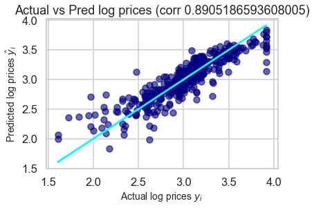


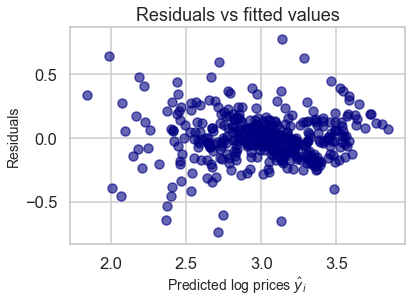


```python
resid_mean=round(results.resid.mean(),3)
resid_skew=round(results.resid.skew(),3)
resid_skew

sns.distplot(results.resid,color='navy')
plt.title('Residuals')
plt.show()
```


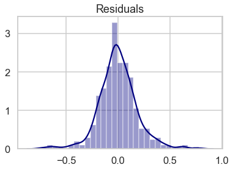


```python
resid_mean
```


    0.0


```python
resid_skew

```


    0.093


```python
prices=np.log(data['PRICE'])
features=data.drop(['PRICE','AGE','INDUS'],axis=1)

X_train,X_test,y_train,y_test=train_test_split(features,prices,
                                               test_size=0.2,random_state=10)

X_incl_const=sm.add_constant(X_train)

model=sm.OLS(y_train,X_incl_const)

results=model.fit()

# residuals=y_train-results.fittedvalues
# residuals.describe()
# results.resid

corr=y_train.corr(results.fittedvalues)
plt.scatter(y_train,results.fittedvalues,c='navy',alpha=0.6)
plt.plot(y_train,y_train,c='cyan')

plt.xlabel('Actual log prices $y _i$',fontsize=14)
plt.ylabel('Predicted log prices $\hat y _i$',fontsize=14)
plt.title(f'Actual vs Pred log prices (corr {corr})')

plt.show()

#residuals vs predicted values
plt.scatter(results.fittedvalues,results.resid,c='navy',alpha=0.6)


plt.xlabel('Predicted log prices $\hat y _i$',fontsize=14)
plt.ylabel('Residuals',fontsize=14)
plt.title(f'Residuals vs fitted values')

plt.show()

#accessing mse
reduced_log_mse=round(results.mse_resid,3)
reduced_log_rsquared=round(results.rsquared,3)


```

    C:\Users\Sushant Lenka\.conda\envs\machineLearning\lib\site-packages\numpy\core\fromnumeric.py:2389: FutureWarning: Method .ptp is deprecated and will be removed in a future version. Use numpy.ptp instead.
      return ptp(axis=axis, out=out, **kwargs)
    


```python
pd.DataFrame({'R-Squared':[reduced_log_rsquared],'MSE':[reduced_log_mse],'RMSE':[np.power(reduced_log_mse,0.5)]},index=['Reduced log model'])
```


<div>
<style scoped>
    .dataframe tbody tr th:only-of-type {
        vertical-align: middle;
    }

    .dataframe tbody tr th {
        vertical-align: top;
    }

    .dataframe thead th {
        text-align: right;
    }
</style>
<table border="1" class="dataframe">
  <thead>
    <tr style="text-align: right;">
      <th></th>
      <th>R-Squared</th>
      <th>MSE</th>
      <th>RMSE</th>
    </tr>
  </thead>
  <tbody>
    <tr>
      <th>Reduced log model</th>
      <td>0.792</td>
      <td>0.035</td>
      <td>0.187083</td>
    </tr>
  </tbody>
</table>
</div>


```python
print('1 S.D in log prices: ',np.sqrt(reduced_log_mse))
print('2 S.D in log prices: ',2*np.sqrt(reduced_log_mse))

upper_bound=np.log(30) + 2*np.sqrt(reduced_log_mse)
print('The upper bound in log prices for a given 30K home is :', upper_bound)
print('The upper bound in normal prices for a given 30K home is :', np.e**upper_bound)

lower_bound=np.log(30) - 2*np.sqrt(reduced_log_mse)
print('The upper bound in log prices for a given 30K home is :', lower_bound)
print('The upper bound in normal prices for a given 30K home is :', np.e**lower_bound)
```

    1 S.D in log prices:  0.18708286933869708
    2 S.D in log prices:  0.37416573867739417
    The upper bound in log prices for a given 30K home is : 3.7753631203395495
    The upper bound in normal prices for a given 30K home is : 43.61334233239937
    The upper bound in log prices for a given 30K home is : 3.0270316429847615
    The upper bound in normal prices for a given 30K home is : 20.635886906824155
    


```python

```


```python

```


```python

```


```python

```


```python

```
